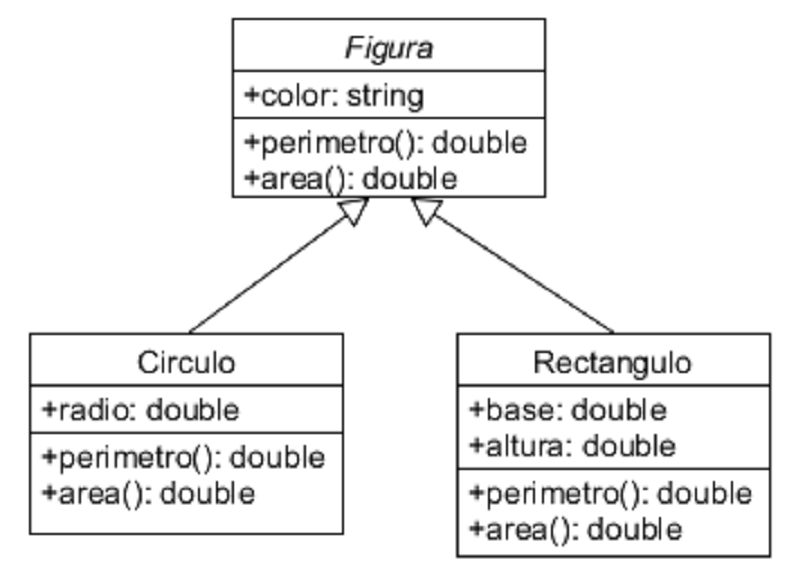

# Tarea 3 - Herencia
#### Melendez Gonzalez Cristian David - 18212222

### 1. Define: Clase Base, Clase Derivada.

#### Clase Base:
La clase a la que sus atributos son heredados.

#### Clase Derivada:
La clase que toma los atributos de la clase base.

### 2.  Haz un diagrama UML donde se muestre la relación de herencia entre las  clases Figura, Recangulo y Circulo como vimos en clase.


### 3. Indica cuales son las clases base y las derivadas.
La clase base viene siendo Figura y las clases derivadas son Rectangulo y Circulo.

### 4. ¿Que es herencia simple y herencia múltiple? ¿En c# se puede hacer herencia múltiple?
La herencia simple es una relación entre una clase padre o clase base y una clase hija o clase derivada y ocurre cuando la clase derivada que estamos manejando sólo llama una clase base.

En la herencia múltiple se usan dos o más clases base para derivar una clase. Compartiendo los atributos y los métodos de más de una clase.

La herencia múltiple no es admitida en C#, sin embargo algunos lenguajes de POO sí la permiten. Sin embargo, en C# la herencia es transitiva, lo que le permite definir una jerarquía de herencia para un conjunto de tipos. Como por ejemplo, el tipo D puede heredar del tipo C, que hereda del tipo B, que hereda del tipo de clase base A. ya que la herencia es transitiva, los miembros de tipo A están disponibles para el tipo D.

### 5. Escribe el programa de Figura como vimos en clase, donde agregues varios tipos de figuras a una lista y recorre la lista llamando a un metodo de las figuras, además:
```csharp
using System;
using System.Collections.Generic;

namespace Tarea3
{
    class Vector2D
    {
        public int x, y;
        public Vector2D(int x, int y)
        {
            this.x=x; this.y=y;
        }
        public override string ToString()
        {
            return String.Format("{0},{1}", x, y);
        }
    }
    abstract class Figura
    {
        public Vector2D position;
        public string fill ,border;

          //Constructor por defecto 
        public Figura():this( new Vector2D(100, 100))
        {
            
        }
        //constructor de figura
        public Figura(Vector2D pos)
        {
            position= pos;
            fill = "white";
            border = "black";
        }
        public abstract void Dibuja();
    }

    class Circulo : Figura
    {
        private int radio;
        public Circulo(Vector2D pos, int radio):base(pos)
        {
            this.radio = radio;
        }
        public Circulo ():base()
        {
            this.radio = 10;
        }

        public override void Dibuja() 
        {
            Console.WriteLine("Se dibuja un circulo en {0} de color {1}", position, fill);
        }

        public void Perimetro()
        {
            Console.WriteLine("Perimetro del Circulo: {0}",((radio*2)*Math.PI));
        }
    }
 
    class Rectangulo : Figura
    {
        public Rectangulo(Vector2D pos):base(pos)
        {
            
        }
        public Rectangulo ():base()
        {
            
        }

        public override void Dibuja() 
        {
            Console.WriteLine("Se dibuja un Rectangulo en {0} de color {1}", position, fill);
        }
    }

    class Triangulo : Figura
    {
        public Triangulo(Vector2D pos):base(pos)
        {
            
        }
        public Triangulo(Vector2D pos,string fill):base(pos)
        {
            this.fill = fill;
        }

        public Triangulo ():base()
        {
            
        }

        public override void Dibuja() 
        {
            Console.WriteLine("Se dibuja un Triangulo en {0} de color {1}", position, fill);
        }
    }

    class Program
    {
        static void Main(string[] args)
        {
            List<Figura> figuras = new List<Figura>();
            figuras.Add(new Circulo());
            figuras.Add(new Rectangulo(new Vector2D(200,200)));
            figuras.Add(new Triangulo(new Vector2D(300,300),"Azul"));
            foreach(Figura f in figuras)
            {
                f.Dibuja();  
            }
            Circulo p = new Circulo();
            p.Perimetro();
        }
    }
}
```
### 5.1 Se sobrecarguen los constructores y se acceda a los constructores de la clase base.
```csharp
abstract class Figura
{
    public Vector2D position;
    public string fill ,border;

    public Figura():this( new Vector2D(100, 100))
    {
        
    }

    public Figura(Vector2D pos)
    {
    position= pos;
    fill = "white";
    border = "black";
    }
}

class Rectangulo : Figura
{
    public Rectangulo(Vector2D pos):base(pos)
    {
            
    }

    public Rectangulo ():base()
    {
            
    }
}
```

### 5.2 Explica para que nos sirve la palabra base.
Se usa para acceder a los miembros de la clase base desde una clase heredada

### 5.3  Haz el método Dibuja() que sea virtual y redefinelo en solo una de las clases derivadas.
```csharp
abstract class Figura
{
    public abstract void Dibuja();
}

class Rectangulo : Figura
{
    public override void Dibuja() 
    {
        Console.WriteLine("Se dibuja un Rectangulo en {0} de color {1}", position, fill);
    }
}
```