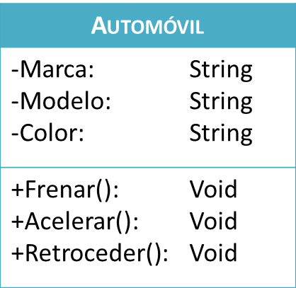
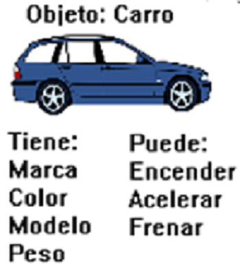
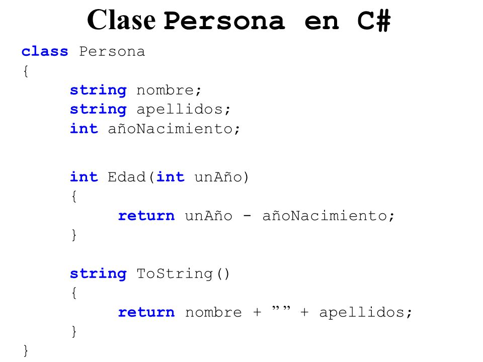
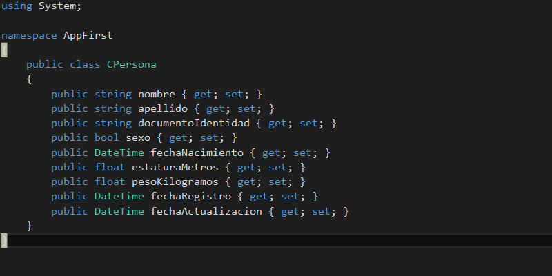
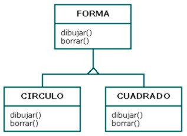
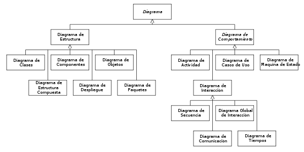
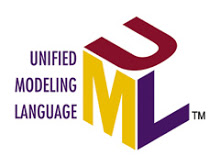

# Tarea 1
#### Melendez Gonzalez Cristian David - 18212222

### Paradigma
Paradigma es como una forma de cómo podemos entender e interpretar lo que es la realidad, un modo de cómo podemos ver el mundo.

Paradigma en el ámbito de programación es un estilo o filosofía de como programar.

### Abstracción
Consiste en separar un objeto de su entorno y darle significado, definiendo el objeto y su comportamiento.

### ¿Por qué decimos que la Clase es el mecanismo de abstracción de los lenguajes OO?
Porque en la clase podemos modelar los objetos que queramos, definir como son, sus detalles, podemos declarar sus comportamientos, entre otras cosas. Por ejemplo, tomamos una bici que existe en la vida real y la convertimos a código mediante la clase.

### Encapsulamiento
El Encapsulamiento sirve para ocultar y proteger los datos, métodos e instrucciones y solo dar acceso a las características específicas del programa.

Es importante ya que gracias al encapsulamiento el usuario solo accede a los datos de interés. Nos puede evitar que se accedan los datos por otro medio no especificado en el programa.

#### Ejemplos:

### Herencia
La herencia se puede ver sencillamente como una relación padre e hijo, por ejemplo, el padre de cuadrado viene siendo forma.

La herencia nos sirve para poder tomar los atributos y elementos de una clase. También para agregar atributos nuevos sin tener que modificar la clase que está heredando los atributos y que no se vea afectada por los cambios realizados.

## UML: Diagrama de clases

### Historia

UML son las siglas de “Unified Modeling Language” o “Lenguaje Unificado de Modelado”. Se trata de un estándar que se ha adoptado a nivel internacional por numerosos organismos y empresas para crear esquemas, diagramas y documentación relativa a los desarrollos de software (programas informáticos).

Bajo la dirección técnica de los Tres Amigos (Rumbaugh, Jacobson y Booch) fue organizado un consorcio internacional llamado UML Partners en 1996 para completar las especificaciones del UML, y para proponerlo como una respuesta al OMG RFP. El borrador de la especificación UML 1.0 de UML Partners fue propuesto a la OMG en enero de 1997. Durante el mismo mes, la UML Partners formó una Fuerza de Tarea Semántica, encabezada por Cris Kobryn y administrada por Ed Eykholt, para finalizar las semánticas de la especificación y para integrarla con otros esfuerzos de estandarización. El resultado de este trabajo, el UML 1.1, fue presentado ante la OMG en agosto de 1997 y adoptado por la OMG en noviembre de 1997.

UML es una herramienta propia de personas que tienen conocimientos relativamente avanzados de programación y es frecuentemente usada por analistas funcionales (aquellos que definen qué debe hacer un programa sin entrar a escribir el código) y analistas-programadores (aquellos que dado un problema, lo estudian y escriben el código informático para resolverlo en un lenguaje como Java, C#, Python o cualquier otro).

El UML está compuesto por diversos elementos gráficos que se combinan para conformar diagramas. Debido a que el UML es un lenguaje, cuenta con reglas para combinar tales elementos. La finalidad de los diagramas es presentar diversas perspectivas de un sistema, a las cuales se les conoce como modelo. El modelo UML describe lo que supuestamente hará un sistema, pero no dice cómo implementar dicho sistema.

Tipos de diagrama de clases:
* Diagrama de Objetos
* Diagrama de Casos de Uso
* Diagrama de Estados
* Diagrama de Secuencias
* Diagrama de Actividades
* Diagrama de Colaboraciones
* Diagrama de Componentes
* Diagrama de Distribución

Herramientas o programas para trabajar con UML:
* Astah community: herramienta sencilla, adecuada para aprender.
* Rational Rose: conjunto de herramientas IBM usado por muchas empresas.
* Lucidchart: herramienta que permite crear muchos tipos de diagramas, entre ellos UML.
* Microsoft Visio: herramienta de Microsoft que permite la creación de muchos tipos de diagramas, entre ellos diagramas UML.
* Otros: Erwin, Oracle Designer, EasyCASE, Power Designer, etc. son herramientas que incorporan muchas utilidades, entre ellas UML.

### ¿Sabes de alguna empresa local que utilice este lenguaje?
No

### Escribe una propuesta de una máquina que venda distintos artículos y haz el diagrama de clases del sistema que propones.